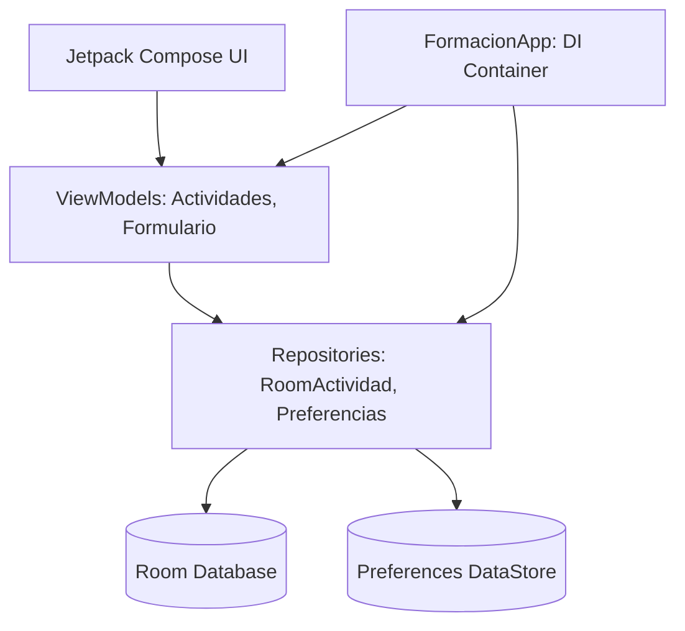

# Mi Formación CTMA — Guía 03: Interfaces Declarativas con Jetpack Compose

## Descripción del Incremento
En este incremento de la Semana 3 se implementó la interfaz gráfica declarativa para consultar los compromisos formativos del Aprendiz mediante Jetpack Compose y Material 3.

## Estructura de la Capa de Presentación
- **`ui/components/TarjetaActividad.kt`**: Componente reutilizable y sin estado (stateless) para renderizar la información de una actividad (título, descripción con soporte de nulos, prioridad y progreso).
- **`ui/screens/PantallaActividades.kt`**: Pantalla principal compuesta por un `Scaffold`, `TopAppBar` y un `LazyColumn` perezoso optimizado con claves estables (`key = { it.id }`).
- **`MainActivity.kt`**: Punto de entrada donde se instancia el repositorio en memoria y se proveen datos de prueba.

---

## Arquitectura y Persistencia (Semana 7)

### Inventario de Datos
| Elemento | Persistencia | Tipo |
| :--- | :--- | :--- |
| Actividades | Room (`ActividadEntity`) | Persistente (Observable Flow) |
| Competencias | Room (`CompetenciaEntity`) | Persistente |
| Filtro de Prioridad | DataStore | Persistente |
| Estado Formulario | `mutableStateOf` | Efímero |

### Diagrama de Arquitectura

### Decisiones Técnicas
- **ViewModel-Repository**: Se migró la lógica de `MainActivity` a ViewModels para mejorar la testabilidad y sobrevivir a cambios de configuración.
- **Singleton Manual**: Se utiliza `FormacionApp` como contenedor de dependencias simple para asegurar una única instancia de la base de datos.
- **Migraciones Controladas**: Se implementó una migración manual de v1 a v2 para añadir el campo `completada` sin pérdida de datos.
- **Pruebas Instrumentadas**: Se añadieron tests de integración para el DAO y validación de migración de esquema.

## Checklist de UX / Accesibilidad

| Criterio / Elemento | Estado | Observación / Hallazgo Corregido |
| :--- | :---: | :--- |
| **Accesibilidad Semántica** | ✅ Cumple | Implementado `Modifier.semantics` en el progreso para lectura correcta por TalkBack. |
| **Adaptabilidad (Large Screens)** | ✅ Cumple | Lista con ancho máximo limitado a 600dp para mejor legibilidad en tablets. |
| **Sistema de Dimensiones** | ✅ Cumple | Centralización de espaciados en `Dimens.kt` eliminando valores hardcoded. |
| **Estado Vacío Proactivo** | ✅ Cumple | Mensaje de estado vacío incluye acción de "Sincronizar". |
| **Manejo de Nulos y Textos** | ✅ Cumple | Soporte de nulos y control de desbordamiento (Ellipsis) en textos largos. |
| **Claves Estables en Listas** | ✅ Cumple | Se asignó `key = { actividad.id }` en `LazyColumn` para optimizar rendimiento. |
